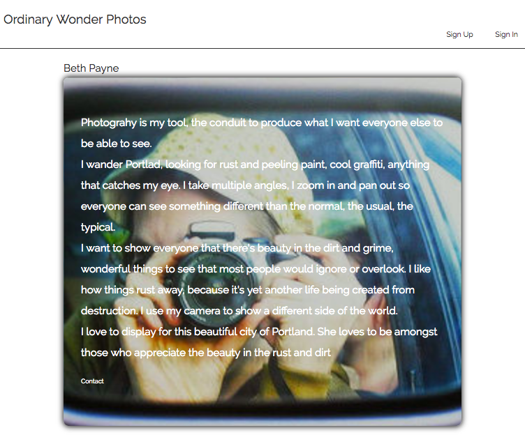
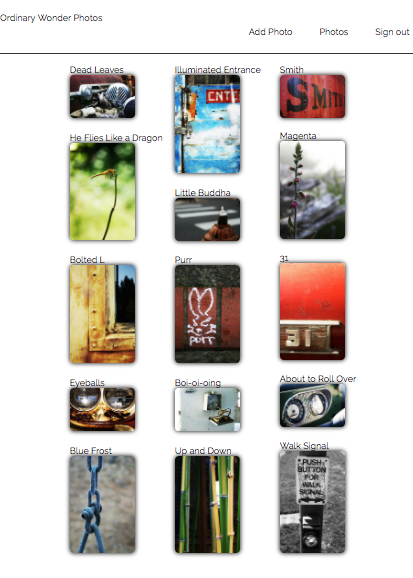

# Ordinary Wonder Photos

#### Rails Authentication Independent Project 7/7/2017

#### By Monique St. Laurent

This is a website for my friend Beth Payne's photography, built using Ruby on Rails. It uses an Active Record database to store photos, and reviews. It provides user authentication so users can create an account, and then view photos and add reviews. It also allows users with admin credentials to add, update and delete photos and reviews. Validations and callbacks are used to make sure that information in the database is properly saved and formatted. 

## Landing Page

## Photos Page

## Detail Page

## Installation and Setup

1. Run:
*  `$ git clone https://github.com/moinstla/ordinary_wonder_photos`
* `$ cd ordinary_wonder_photos`
* `$ bundle install`
* `$ bundle exec rails db:setup`
* `$ bundle exec rails server`

2. Navigate to http://localhost:3000

* Provided admin credentials are: admin@admin.com, 123456

## Technologies Used
Ruby
Rails
Bundler
Postgres
RSpec
Javascript (ES6)
Jquery 3
HTML5
SASS
FactoryGirl
devise
SimpleCov

## License Information

MIT License

Copyright (c) 2017

Permission is hereby granted, free of charge, to any person obtaining a copy of this software and associated documentation files (the "Software"), to deal in the Software without restriction, including without limitation the rights to use, copy, modify, merge, publish, distribute, sublicense, and/or sell copies of the Software, and to permit persons to whom the Software is furnished to do so, subject to the following conditions:

The above copyright notice and this permission notice shall be included in all copies or substantial portions of the Software.

THE SOFTWARE IS PROVIDED "AS IS", WITHOUT WARRANTY OF ANY KIND, EXPRESS OR IMPLIED, INCLUDING BUT NOT LIMITED TO THE WARRANTIES OF MERCHANTABILITY, FITNESS FOR A PARTICULAR PURPOSE AND NONINFRINGEMENT. IN NO EVENT SHALL THE AUTHORS OR COPYRIGHT HOLDERS BE LIABLE FOR ANY CLAIM, DAMAGES OR OTHER LIABILITY, WHETHER IN AN ACTION OF CONTRACT, TORT OR OTHERWISE, ARISING FROM, OUT OF OR IN CONNECTION WITH THE SOFTWARE OR THE USE OR OTHER DEALINGS IN THE SOFTWARE.
